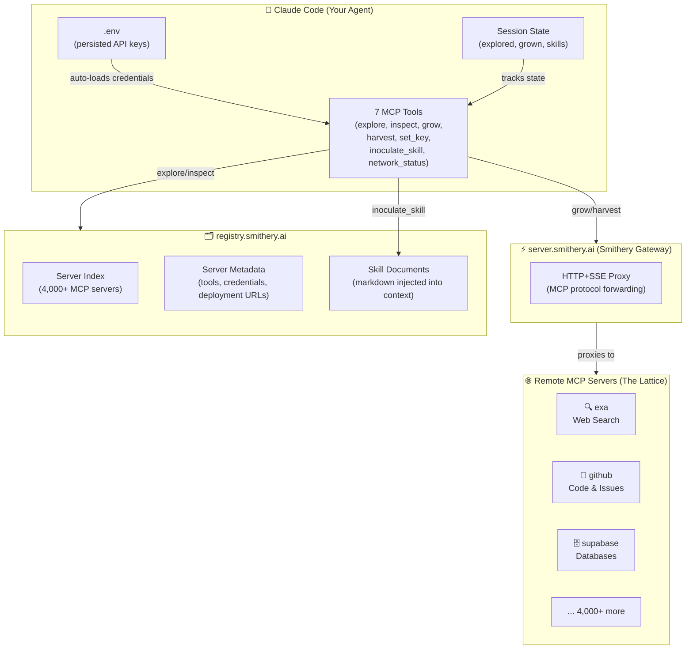
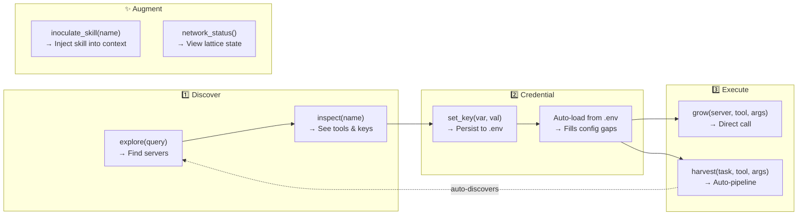
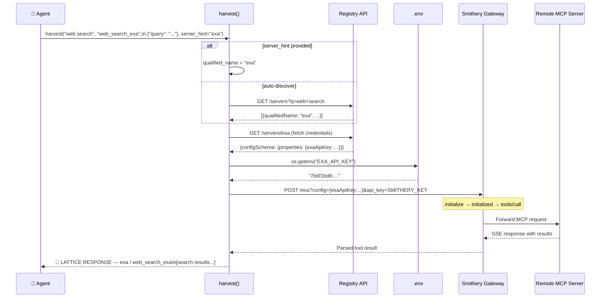
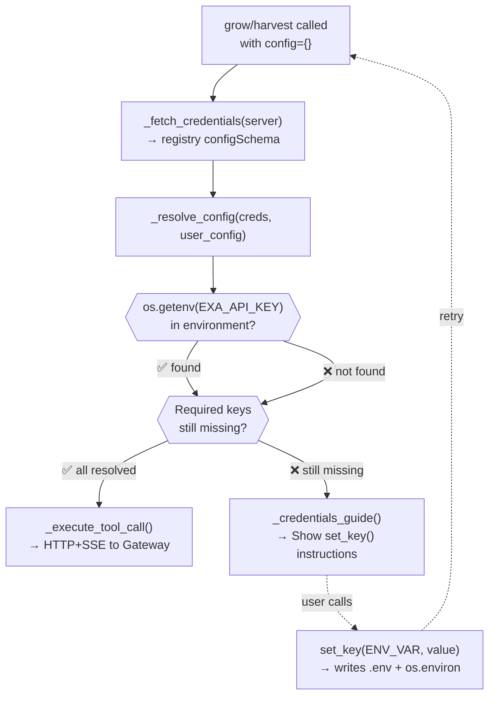
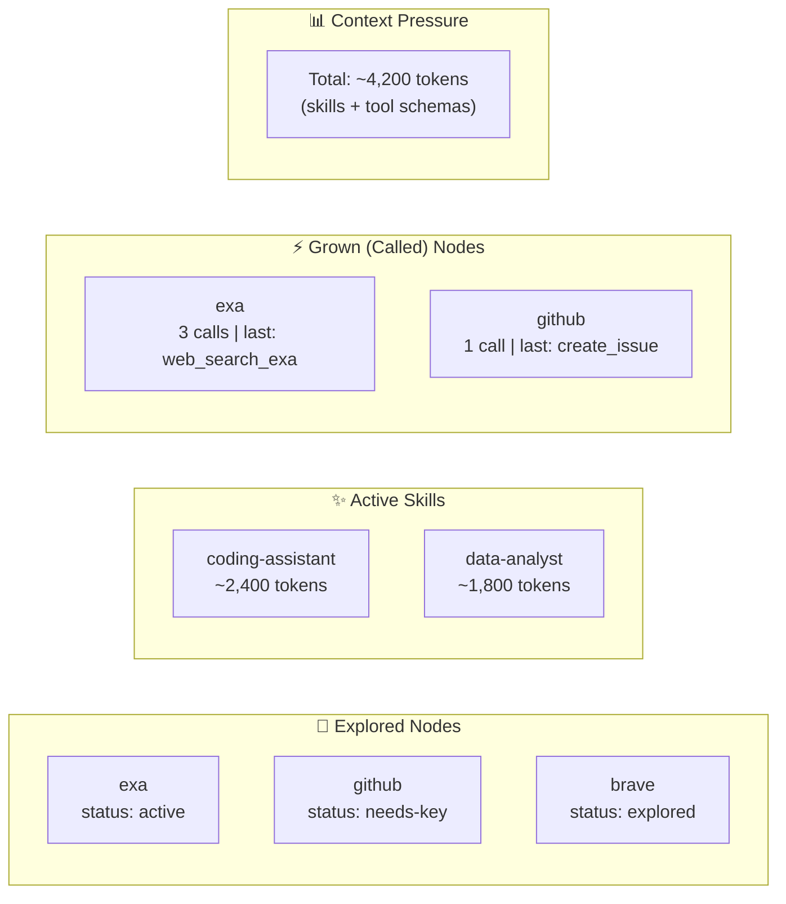

# Smithery Lattice — Architecture & Visualizations

## System Architecture

```mermaid
graph TB
    subgraph Claude["🤖 Claude Code (Your Agent)"]
        Tools["7 MCP Tools\n(explore, inspect, grow,\nharvest, set_key,\ninoculate_skill, network_status)"]
        Session["Session State\n(explored, grown, skills)"]
        DotEnv[".env\n(persisted API keys)"]
    end

    subgraph Registry["🗂️ registry.smithery.ai"]
        ServerList["Server Index\n(4,000+ MCP servers)"]
        ServerMeta["Server Metadata\n(tools, credentials, deployment URLs)"]
        SkillDocs["Skill Documents\n(markdown injected into context)"]
    end

    subgraph Gateway["⚡ server.smithery.ai (Smithery Gateway)"]
        Proxy["HTTP+SSE Proxy\n(MCP protocol forwarding)"]
    end

    subgraph Lattice["🌐 Remote MCP Servers (The Lattice)"]
        Exa["🔍 exa\nWeb Search"]
        GitHub["🐙 github\nCode & Issues"]
        Supabase["🗄️ supabase\nDatabases"]
        More["... 4,000+ more"]
    end

    Tools -->|"explore/inspect"| Registry
    Tools -->|"inoculate_skill"| SkillDocs
    Tools -->|"grow/harvest"| Gateway
    Gateway -->|"proxies to"| Lattice
    DotEnv -->|"auto-loads credentials"| Tools
    Session -->|"tracks state"| Tools
```

## Tool Pipeline

```mermaid
flowchart LR
    subgraph Discover["1️⃣ Discover"]
        E["explore(query)\n→ Find servers"]
        I["inspect(name)\n→ See tools & keys"]
    end

    subgraph Credential["2️⃣ Credential"]
        SK["set_key(var, val)\n→ Persist to .env"]
        AutoLoad["Auto-load from .env\n→ Fills config gaps"]
    end

    subgraph Execute["3️⃣ Execute"]
        G["grow(server, tool, args)\n→ Direct call"]
        H["harvest(task, tool, args)\n→ Auto-pipeline"]
    end

    subgraph Augment["✨ Augment"]
        IS["inoculate_skill(name)\n→ Inject skill into context"]
        NS["network_status()\n→ View lattice state"]
    end

    E --> I
    I --> SK
    SK --> AutoLoad
    AutoLoad --> G
    AutoLoad --> H
    H -.->|"auto-discovers"| E
```

## harvest() Auto-Pipeline

```mermaid
sequenceDiagram
    participant U as 🤖 Agent
    participant H as harvest()
    participant R as Registry API
    participant E as .env
    participant S as Smithery Gateway
    participant M as Remote MCP Server

    U->>H: harvest("web search", "web_search_exa",\n  {"query": "..."}, server_hint="exa")

    alt server_hint provided
        H->>H: qualified_name = "exa"
    else auto-discover
        H->>R: GET /servers?q=web+search
        R-->>H: [{qualifiedName: "exa", ...}]
    end

    H->>R: GET /servers/exa (fetch credentials)
    R-->>H: {configSchema: {properties: {exaApiKey: ...}}}

    H->>E: os.getenv("EXA_API_KEY")
    E-->>H: "7b6f1bd8-..."

    H->>S: POST /exa?config={exaApiKey:...}&api_key=SMITHERY_KEY
    Note over S: initialize → initialized → tools/call
    S->>M: Forward MCP request
    M-->>S: SSE response with results
    S-->>H: Parsed tool result

    H-->>U: 🔷 LATTICE RESPONSE — exa / web_search_exa\n[search results...]
```

## Credential Auto-Load Flow

```mermaid
flowchart TD
    Call["grow/harvest called\nwith config={}"]
    Fetch["_fetch_credentials(server)\n→ registry configSchema"]
    Resolve["_resolve_config(creds, user_config)"]

    Env{{"os.getenv(EXA_API_KEY)\nin environment?"}}
    Missing{{"Required keys\nstill missing?"}}
    Execute["_execute_tool_call()\n→ HTTP+SSE to Gateway"]
    Guide["_credentials_guide()\n→ Show set_key() instructions"]

    Call --> Fetch --> Resolve --> Env
    Env -->|"✅ found"| Missing
    Env -->|"❌ not found"| Missing
    Missing -->|"✅ all resolved"| Execute
    Missing -->|"❌ still missing"| Guide
    Guide -.->|"user calls"| SK["set_key(ENV_VAR, value)\n→ writes .env + os.environ"]
    SK -.->|"retry"| Call
```

## Network State (network_status)

```mermaid
graph LR
    subgraph Explored["🔷 Explored Nodes"]
        E1["exa\nstatus: active"]
        E2["github\nstatus: needs-key"]
        E3["brave\nstatus: explored"]
    end

    subgraph Skills["✨ Active Skills"]
        S1["coding-assistant\n~2,400 tokens"]
        S2["data-analyst\n~1,800 tokens"]
    end

    subgraph Grown["⚡ Grown (Called) Nodes"]
        G1["exa\n3 calls | last: web_search_exa"]
        G2["github\n1 call | last: create_issue"]
    end

    subgraph Pressure["📊 Context Pressure"]
        P["Total: ~4,200 tokens\n(skills + tool schemas)"]
    end
```
