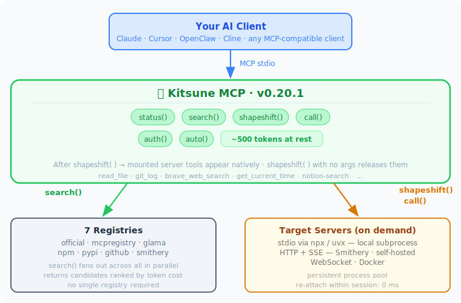
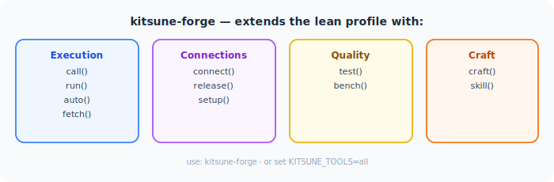

<div align="center">
  
  <h1>🦎 Chameleon MCP</h1>
  <p><strong>Morph into any MCP server — live, no config, minimal tokens.</strong></p>
</div>

[](https://pypi.org/project/chameleon-mcp/)
[](https://pypi.org/project/chameleon-mcp/)
[](https://github.com/kaiser-data/chameleon-mcp/actions)
[](LICENSE)
[](https://smithery.ai/server/@kaiser-data/chameleon-mcp)

---

## The core idea

One server in your config. Become any other server on demand.

```
search("web scraping")                            # find it
morph("@modelcontextprotocol/server-puppeteer")   # inject its tools live — no restart
puppeteer_navigate(url="https://example.com")     # call them natively
shed()                                            # clean exit
```

**6 tools. ~240 tokens overhead. Zero config edits.**

`morph()` registers a server's tools directly on Chameleon via FastMCP's live API — no wrapper, no indirection. `shed()` removes them cleanly. The whole session costs less than having one extra server permanently configured.

Need only specific tools? Use lean morph:
```
morph("@modelcontextprotocol/server-filesystem", tools=["read_file", "write_file"])
# only 2 tools appear instead of 10
```

---

## The Problem

Thousands of MCP servers exist, but trying one means: find it, edit `mcp.json`, restart your client, use it briefly, edit `mcp.json` again. Every configured server also sends its full tool list on **every request** — 5 servers × 10 tools × ~250 tokens = 12,500 tokens burned before you've said a word.

---

## Two modes

| | `chameleon-mcp` | `chameleon-forge` |
|---|---|---|
| **Purpose** | Everyday morphing | Evaluation + crafting |
| **Tools** | 6 (morph, shed, search, inspect, key, status) | All 17 |
| **Token overhead** | ~240 tokens | ~825 tokens |
| **Use when** | Switching fast between servers, agents morphing on demand | Discovering, benchmarking, prototyping custom tools |

**Ideal for agents** — `morph()` switches an agent's entire capability set in one call. Acquire a tool, do the work, shed it, acquire the next — no config changes, no restarts, minimal token cost.

Both modes from the same package:

```json
{ "command": "chameleon-mcp" }                        ← lean (default)
{ "command": "chameleon-forge" }                      ← full suite
{ "command": "chameleon-mcp",
  "env": { "CHAMELEON_TOOLS": "morph,shed,key" } }    ← custom
```

---

## How It Fits Together

<div align="center">
  
</div>

`morph()` injects tools directly at runtime via FastMCP's live API. Token overhead stays flat regardless of how many servers you explore.

Need the full evaluation suite? `chameleon-forge` adds execution, connections, benchmarking, and tool crafting:

<div align="center">
  
</div>

---

## Quick Start

```bash
pip install chameleon-mcp
```

Add to your MCP client config — **once, globally**:

```json
{
  "mcpServers": {
    "chameleon": {
      "command": "chameleon-mcp"
    }
  }
}
```

Works with Claude Desktop, Claude Code, Cursor, Cline, OpenClaw, Continue.dev, Zed, and any MCP-compatible client. No API keys needed.

| Client | Global config file |
|---|---|
| Claude Desktop (macOS) | `~/Library/Application Support/Claude/claude_desktop_config.json` |
| Claude Desktop (Windows) | `%APPDATA%\Claude\claude_desktop_config.json` |
| Claude Code | `~/.claude/mcp.json` |
| Cursor / Windsurf | `~/.cursor/mcp.json` |
| Cline / Continue.dev | VS Code settings / `~/.continue/config.json` |
| OpenClaw | MCP config in OpenClaw settings |

---

## Server Sources

Chameleon searches across multiple registries — no single one required.

| Registry | Auth | `registry=` value |
|---|---|---|
| [modelcontextprotocol/servers](https://github.com/modelcontextprotocol/servers) | None | `official` |
| [registry.modelcontextprotocol.io](https://registry.modelcontextprotocol.io) | None | `mcpregistry` |
| [Glama](https://glama.ai/mcp/servers) | None | `glama` |
| [npm](https://npmjs.com) | None | `npm` |
| [PyPI](https://pypi.org) | None | `pypi` |
| GitHub repos | None | `github:owner/repo` |
| [Smithery](https://smithery.ai) | Free API key | `smithery` |

Default `search()` fans out across all no-auth registries automatically. Add a `SMITHERY_API_KEY` to include Smithery's 3,000+ verified servers.

---

## How It Works

Traditional MCP hubs route calls through a wrapper: `hub.call("exa", "web_search", args)`. Chameleon goes further — it **becomes** the server:

```
Before morph():
  Claude → Chameleon (search, inspect, morph, shed, ...)

After morph("@modelcontextprotocol/server-filesystem"):
  Claude → Chameleon (..., read_file, write_file, list_directory, ...)
```

The morphed tools appear natively — no extra prompt overhead, no indirection.

**Transport is automatic:**

| Server source | How it runs |
|---|---|
| npm package | `npx <package>` — spawned locally |
| pip package | `uvx <package>` — spawned locally |
| GitHub repo | `npx github:user/repo` or `uvx --from git+https://...` |
| Docker image | `docker run --rm -i --memory 512m <image>` |
| Smithery remote | HTTP+SSE via `server.smithery.ai` (requires API key) |
| WebSocket server | `ws://` / `wss://` |

---

## Why Not Just X?

**"Can't I just add more servers to `mcp.json`?"** — Every configured server starts at launch and exposes all tools constantly. You can't add or remove mid-session without a restart. Chameleon's tool list stays minimal; morph in what you need, shed it when done.

**"What about `mcp-dynamic-proxy`?"** — It hides tools behind `call_tool("brave", "web_search", {...})` — always a wrapper. After `morph("mcp-server-brave-search")`, Chameleon gives you a real native `brave_web_search` with the actual schema. Plus mcp-dynamic-proxy requires a static config file; it can't discover or install packages at runtime.

**"Can FastMCP do this natively?"**

| | FastMCP native | Chameleon |
|---|:---:|:---:|
| Proxy a known HTTP/SSE server | ✅ | ✅ |
| Mount tools at runtime | ✅ (write code) | ✅ `morph()` |
| Search registries to discover servers | ❌ | ✅ npm · official · Glama · Smithery |
| Install npm / PyPI / GitHub packages on demand | ❌ | ✅ |
| Atomic shed — retract all morphed tools at once | ❌ | ✅ `shed()` |
| Persistent stdio process pool | ❌ | ✅ |
| Zero boilerplate — works after `pip install` | ❌ | ✅ |

---

## Configuration

### Minimal (no API keys)

```json
{
  "mcpServers": {
    "chameleon": { "command": "chameleon-mcp" }
  }
}
```

### With Smithery (optional)

```json
{
  "mcpServers": {
    "chameleon": {
      "command": "chameleon-mcp",
      "env": { "SMITHERY_API_KEY": "your-key" }
    }
  }
}
```

Get a free key at [smithery.ai/account/api-keys](https://smithery.ai/account/api-keys). Without it, Chameleon is fully functional via npm, PyPI, official registries, and GitHub.

**Per-session API keys** — use `key()` instead of pre-configuring everything:

```
key("BRAVE_API_KEY", "your-key")   # saved to .env, auto-loaded next session
key("EXA_API_KEY",   "your-key")
```

---

## All Tools

### `chameleon-mcp` — lean profile (6 tools, ~240 token overhead)

| Tool | Description |
|---|---|
| `morph(server_id, tools)` | Inject a server's tools live. `tools=[...]` for lean morph. |
| `shed(release)` | Remove morphed tools. `release=True` kills the process immediately. |
| `search(query, registry)` | Search MCP servers across registries. |
| `inspect(server_id)` | Show server tools, schemas, and required credentials. |
| `key(env_var, value)` | Save an API key to `.env` and load it immediately. |
| `status()` | Show current form, active connections (PID + RAM), token stats. |

### `chameleon-forge` — full suite (all 17 tools, ~825 token overhead)

Everything above, plus:

| Tool | Description |
|---|---|
| `call(server_id, tool, args)` | One-shot tool call — no morph needed. |
| `run(package, tool, args)` | Run from npm/pip directly. `uvx:pkg-name` for Python. |
| `auto(task, tool, args)` | Search → pick best server → call in one step. |
| `fetch(url, intent)` | Fetch a URL, return compressed text (~17x smaller than raw HTML). |
| `craft(name, description, params, url)` | Register a custom tool backed by your HTTP endpoint. `shed()` removes it. |
| `connect(command, name)` | Start a persistent server. Accepts server_id or shell command. |
| `release(name)` | Kill a persistent connection by name. |
| `setup(name)` | Step-by-step setup wizard for a connected server. |
| `test(server_id, level)` | Quality-score a server 0–100. |
| `bench(server_id, tool, args)` | Benchmark tool latency — p50, p95, min, max. |
| `skill(qualified_name)` | Load a skill into context. Persisted across sessions. |

---

## Usage Examples

### Official servers — no API key

```
morph("@modelcontextprotocol/server-filesystem")
read_file(path="/tmp/notes.txt")
shed()

morph("@modelcontextprotocol/server-git")
git_log(repo_path="/path/to/repo", max_count=10)
shed()
```

### Search, morph, use, shed

```
search("web search")
morph("mcp-server-brave-search")
key("BRAVE_API_KEY", "your-key")
brave_web_search(query="MCP protocol 2025")
shed()
```

### Lean morph — only the tools you need

```
morph("@modelcontextprotocol/server-filesystem", tools=["read_file", "list_directory"])
read_file(path="/tmp/notes.txt")
shed()
```

### Persistent server with setup guidance

```
connect("uvx voice-mode", name="voice")
setup("voice")                      # shows missing env vars
key("DEEPGRAM_API_KEY", "your-key")
setup("voice")                      # confirms ready
morph("voice-mode")
speak(text="Hello from Chameleon!")
shed(release=True)                  # kills process, frees RAM
```

### craft() — prototype against your own endpoint

```
craft(
    name="my_ranker",
    description="Rank results by relevance",
    params={"results": {"type": "array"}, "query": {"type": "string"}},
    url="http://localhost:8080/rank"
)
my_ranker(results=[...], query="MCP servers")
shed()
```

---

## Installation

```bash
pip install chameleon-mcp        # from PyPI
# or
git clone https://github.com/kaiser-data/chameleon-mcp && pip install -e .
```

**Requirements:** Python 3.12+ · `node`/`npx` (for npm servers) · `uvx` from [uv](https://github.com/astral-sh/uv) (for pip servers)

---

## Contributing

```bash
make dev     # install with dev dependencies
make test    # pytest
make lint    # ruff
```

Issues and PRs: [github.com/kaiser-data/chameleon-mcp](https://github.com/kaiser-data/chameleon-mcp)

---

*MIT License · Python 3.12+ · Built on [FastMCP](https://github.com/jlowin/fastmcp)*
